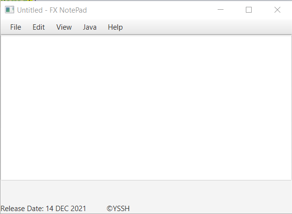
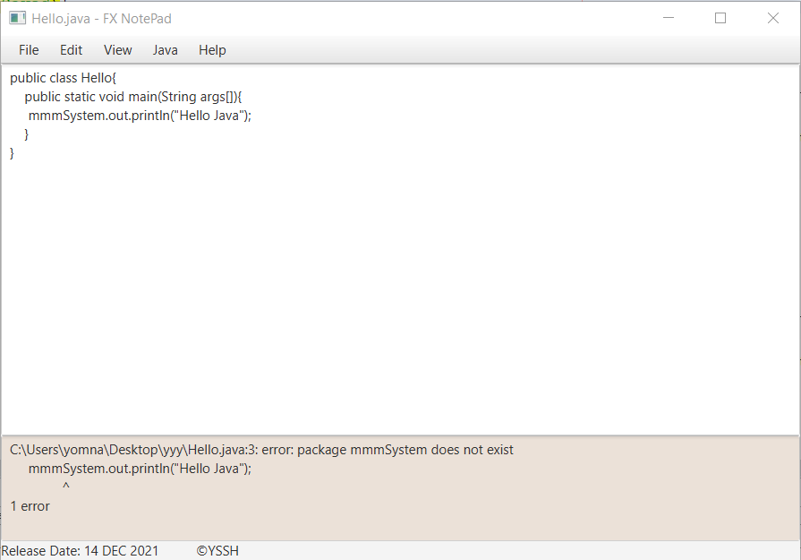
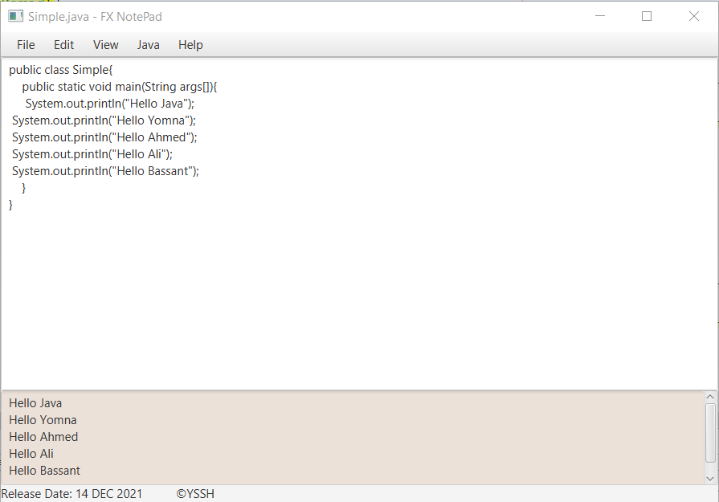

# Notepad application using javaFX

FX NotePad has the following properties:

- New file
- Edit file
- Save file
- Open file
- Mark unsaved files with "*" before file's name
- Compile ".java" file and extract ".class" file
- Run ".class" file
- Show output on an emdedded terminal.

## Demo Link
- https://youtu.be/98gE2IEz5rA

## Application
### Application on start

### Application compiles java code that has an error

### Application runs java code

